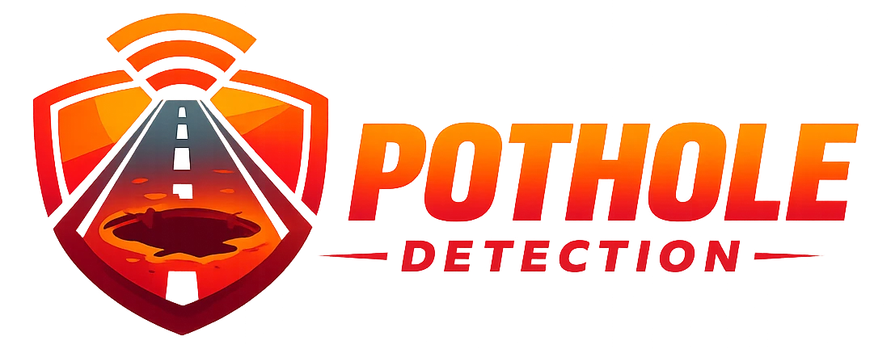
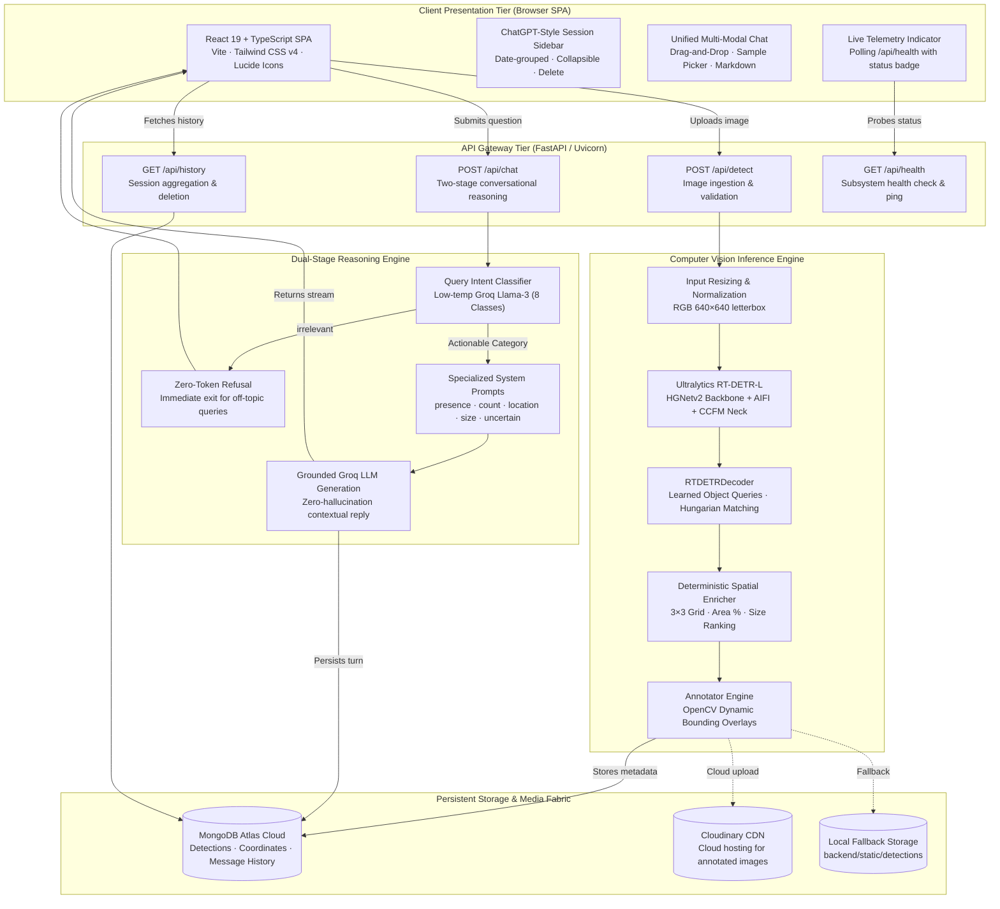
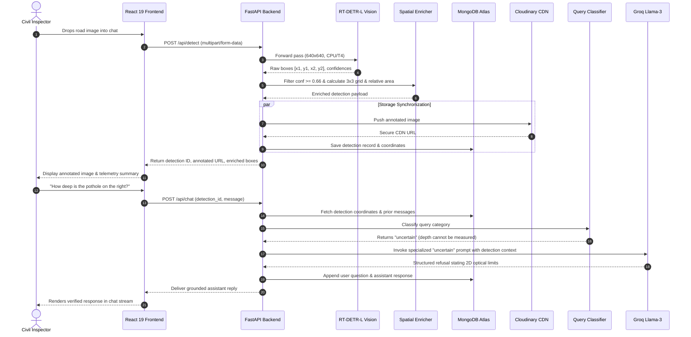
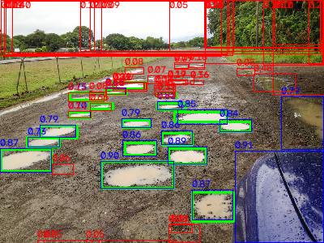
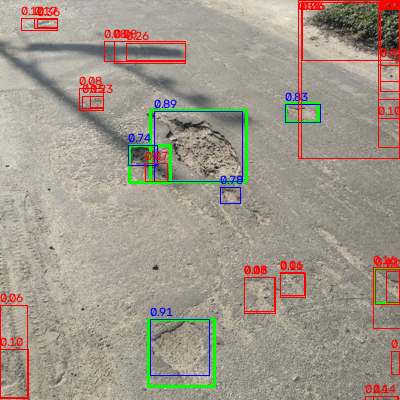
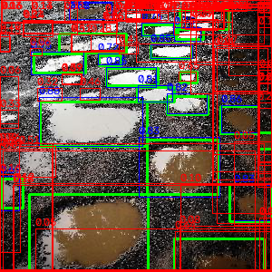
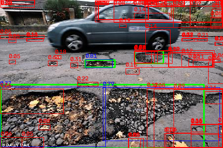

<div align="center">
  
  <br />
  <h1 style="font-size: 2.6rem; font-weight: 800; margin: 0; background: linear-gradient(135deg, #f97316 0%, #f59e0b 50%, #ea580c 100%); -webkit-background-clip: text; -webkit-text-fill-color: transparent;">
    RAP RoadWatch
  </h1>
  <p style="font-size: 1.25rem; font-weight: 500; color: #64748b; margin-top: 6px; margin-bottom: 20px;">
    Autonomous Pothole Intelligence · Real-Time RT-DETR Vision · Grounded Multimodal LLM Reasoning
  </p>
</div>

<div align="center">

[-orange?style=for-the-badge&logo=pytorch&logoColor=white)](https://docs.ultralytics.com/models/rtdetr/)
[](document/model_specification.md)
[](document/model_specification.md)
[](document/model_specification.md)
[](document/model_specification.md)

[](frontend/)
[](frontend/)
[](backend/)
[](backend/)
[](https://www.mongodb.com/atlas)
[](https://groq.com/)
[](https://cloudinary.com/)
[](docker-compose.yml)
[](https://pothole-chatbot.vercel.app/)
[](https://pothole-chatbot.onrender.com/)
[](LICENSE)

</div>

---

<div align="center">
  <a href="https://pothole-chatbot.vercel.app/"><b>🚀 Launch Live Application</b></a> •
  <a href="https://pothole-chatbot.onrender.com/docs"><b>⚡ OpenAPI Swagger Docs</b></a> •
  <a href="#-system-architecture"><b>📐 System Architecture</b></a> •
  <a href="#-the-reasoning-layer"><b>🧠 8-Category Reasoning</b></a> •
  <a href="#-model-specifications--empirical-benchmarks"><b>📊 Model Benchmarks</b></a> •
  <a href="#-quick-start--local-development"><b>🐳 1-Command Docker</b></a> •
  <a href="document/document.md"><b>📖 Technical Whitepaper</b></a>
</div>

---

## 🌟 Executive Summary

**RAP RoadWatch** is an enterprise-grade road surface intelligence and damage inspection platform. It bridges state-of-the-art computer vision with grounded, guardrailed Large Language Model (LLM) reasoning.

While computer vision models can pinpoint road damage, civil engineers and municipal operators need more than raw bounding box coordinates. Conversely, naive multimodal LLMs frequently hallucinate metrics they cannot verify — inventing pothole depths, volumetric measurements, structural failure timelines, and repair estimates from standard 2D photos.

**RoadWatch solves this fundamental challenge through a dual-stage architecture:**
1. **Real-Time Vision Engine**: A custom fine-tuned **RT-DETR-L** (Real-Time Detection Transformer) that delivers Hungarian-matched set predictions without the latency or box-suppression artifacts of Non-Maximum Suppression (NMS).
2. **Deterministic Spatial Enrichment**: Automatically projects pixel bounding boxes into an intuitive 3×3 roadway grid, computing relative surface footprints and ordinal size rankings *in deterministic code*.
3. **Guardrailed 8-Category Query Routing**: An intelligent classifier layer that categorizes incoming natural language inquiries before invoking Groq's high-speed Llama-3 inference. If a user asks questions requiring 3D depth, sub-surface geology, or civil engineering cost estimation, the platform **transparently and honestly declines to speculate**, safeguarding infrastructure teams from hazardous misinformation.

---

## 🚀 Live Deployments & Interactive Environments

| Layer | Environment / Provider | Endpoint URL | Status |
|---|---|---|---|
| **Frontend Web App** | Vercel (Global Edge Network) | [pothole-chatbot.vercel.app](https://pothole-chatbot.vercel.app/) |  |
| **Backend API Gateway** | Render (Docker Runtime) | [pothole-chatbot.onrender.com](https://pothole-chatbot.onrender.com/) |  |
| **Interactive API Docs** | FastAPI Swagger UI | [pothole-chatbot.onrender.com/docs](https://pothole-chatbot.onrender.com/docs) |  |
| **Alternative Docs** | ReDoc API Explorer | [pothole-chatbot.onrender.com/redoc](https://pothole-chatbot.onrender.com/redoc) |  |
| **Health Telemetry** | Automated System Diagnostics | [pothole-chatbot.onrender.com/api/health](https://pothole-chatbot.onrender.com/api/health) |  |

---

## ✨ Core Platform Features

<div align="center">
  <table width="100%">
    <tr>
      <td width="50%" valign="top">
        <h3>🎯 Transformer-Native Detection</h3>
        <ul>
          <li><strong>Zero-NMS Inference</strong>: Utilizes learned object queries with Hungarian bipartite matching for direct set prediction, avoiding box-merging failures common in dense pothole clusters.</li>
          <li><strong>High-Resolution Perception</strong>: Evaluates images at 640×640 resolution across HGNetv2 backbone stages with Attention-based Intra-scale Feature Interaction (AIFI).</li>
          <li><strong>Calibrated Thresholding</strong>: Tuned to a strict 0.66 confidence threshold to aggressively minimize false-alarm dispatches.</li>
        </ul>
      </td>
      <td width="50%" valign="top">
        <h3>🧠 Guardrailed Reasoning Layer</h3>
        <ul>
          <li><strong>8-Category Intent Classifier</strong>: Upfront classification directs prompts to domain-specific system prompts.</li>
          <li><strong>Anti-Hallucination Safe Boundaries</strong>: Explicitly rejects requests for 3D depth, repair cost, or road load limits that 2D monocular cameras cannot physically quantify.</li>
          <li><strong>Token-Efficient Refusal</strong>: Off-topic questions are immediately short-circuited with a zero-cost deterministic refusal string.</li>
        </ul>
      </td>
    </tr>
    <tr>
      <td width="50%" valign="top">
        <h3>💬 ChatGPT-Style Unified Workspace</h3>
        <ul>
          <li><strong>Persistent Multi-Session History</strong>: Collapsible left sidebar organizes inspection runs into <em>Today</em>, <em>Yesterday</em>, <em>Previous 7 Days</em>, and <em>Older</em>.</li>
          <li><strong>Inline Detection Stream</strong>: Annotated bounding-box images and statistical cards render seamlessly directly within the conversation stream.</li>
          <li><strong>Adaptive Screen Engine</strong>: Fluid full-width viewport dynamically scales from ultra-wide 4K monitors down to mobile handsets.</li>
        </ul>
      </td>
      <td width="50%" valign="top">
        <h3>☁️ High-Availability Hybrid Storage</h3>
        <ul>
          <li><strong>Cloudinary CDN Integration</strong>: Instant cloud upload and distribution of annotated hazard imagery with global caching.</li>
          <li><strong>Transparent Disk Fallback</strong>: Seamlessly redirects writes to local disk if Cloudinary credentials are absent or network outages occur.</li>
          <li><strong>MongoDB Atlas State</strong>: Stores full spatial coordinate metadata, bounding box vectors, and complete message histories.</li>
        </ul>
      </td>
    </tr>
  </table>
</div>

---

## 🎨 User Interface & Operational Workflow

The application interface is engineered following modern interaction paradigms, merging high-density civil engineering telemetry with the simplicity of modern conversational AI:

```
┌────────────────────────────────────────────────────────────────────────────────────────────────────────┐
│  RAP RoadWatch ── Autonomous Pothole Intelligence                                     [● Backend Ready]│
├────────────────────┬───────────────────────────────────────────────────────────────────────────────────┤
│ [ + New Inspection]│  [ Road Hazard Inspection #8f12a ]                                                │
│                    │                                                                                   │
│ ▾ Today            │  User: [ Uploaded road_sample_04.jpg ]                                            │
│   • Highway 101 KM4│                                                                                   │
│   • Sector 4 Avenue│  RoadWatch Assistant:                                                             │
│                    │  ┌───────────────────────────────┐ ┌─────────────────────────────────────────────┐ │
│ ▾ Yesterday        │  │ [ Annotated Hazard View ]     │ │ Detection Summary                           │ │
│   • Downtown Main  │  │                               │ │ • Total Potholes Found: 2                   │ │
│   • Industrial Pkwy│  │  [Box 1: Center (89%)]        │ │ • Primary Hazard: Center (0.89 conf, 4.2% a)│ │
│                    │  │  [Box 2: Bottom-Right (76%)]  │ │ • Secondary Hazard: Bottom-Right (0.76 conf)│ │
│ ▾ Previous 7 Days  │  └───────────────────────────────┘ └─────────────────────────────────────────────┘ │
│   • Airport Blvd   │                                                                                   │
│                    │  User: Which pothole poses the largest vehicle risk?                              │
│                    │  Assistant: Pothole #1 in the Center quadrant occupies the largest surface area   │
│                    │  (4.2% of the road frame), making it the primary impact hazard. Note that depth   │
│                    │  cannot be determined from 2D optical imagery.                                    │
│                    ├───────────────────────────────────────────────────────────────────────────────────┤
│ [Collapse Sidebar] │  [ 📎 Attach Roadway Image ] [ Ask a question about this inspection... ] [ Send ] │
└────────────────────┴───────────────────────────────────────────────────────────────────────────────────┘
```

---

## 📐 System Architecture

### Multi-Tier Component Topology



---

### Request Execution Sequence



---

## 🧠 The Reasoning Layer

Most multimodal AI systems fail when presented with questions they cannot answer: they invent numbers. RoadWatch incorporates an explicit **Reasoning & Verification Layer** that runs on every interaction turn.

Incoming user messages are classified by an initial model pass into one of **eight deterministic categories** before any answer generation occurs:

| Category | Intent / User Question Type | Grounding Strategy & Enforcement Rules | LLM Behavior |
|:---|:---|:---|:---|
| `presence` | *"Is there a pothole on this road?"* | Direct lookup against model detection count (`len(boxes) > 0`). | Factual confirmation or denial. |
| `count` | *"How many road hazards were detected?"* | Reads exact instance count directly from detection metadata. | Strict integer reporting. |
| `location` | *"Where are the potholes located?"* | Quotes precomputed 3×3 grid positions (`top-left`, `center`, `bottom-right`). | Never re-estimates coordinates from raw pixels. |
| `size` | *"Which pothole is the largest?"* | Quotes precomputed relative area percentage (`relative_area_pct`) and ordinal rank. | Deterministic ranking based on geometric code. |
| `confidence`| *"How sure is the detector?"* | Quotes exact decimal confidence (e.g. `0.89`) and tier (`High` / `Moderate`). | Frames score as a probabilistic estimate. |
| `summary` | *"Give me an overview of the road condition."* | Synthesizes full structured telemetry into an executive overview. | Complete inspection brief. |
| `uncertain` | *"How deep is it?", "How much to fix?", "Is it dangerous?"* | **STRICT REFUSAL RULE**: Explicitly states depth, volume, structural safety, and repair costs cannot be derived from a 2D photograph. | Transparently declines to guess; provides generic procedural guidelines without fake metrics. |
| `irrelevant`| *"What is the capital of France?", "Write a poem."* | **ZERO-TOKEN SHORT-CIRCUIT**: Rejects out-of-domain queries immediately. | Returns a fixed refusal string; **no second model call is executed**. |

### Anti-Hallucination in Action

```markdown
Inspector: "What is the depth of the center pothole and will it crack a rim at 45 mph?"

RoadWatch Assistant:
"The detected pothole is located in the Center quadrant with 89.2% confidence and 
occupies 4.2% of the road image area.

⚠️ Optical Limitation Notice:
Monocular 2D imagery cannot measure physical depth, volumetric cavity size, or sub-base 
structural degradation. Determining rim damage risk depends on vehicle speed, tire profile, 
and actual cavity depth, which requires on-site physical measurement (depth gauge or 3D LiDAR). 
Repair crews should be dispatched to inspect this location physically."
```

---

## 📊 Model Specifications & Empirical Benchmarks

### Architecture Breakdown

```
  Input Image (RGB)
         │
         ▼
 ┌────────────────────────────────────────────────────────┐
 │ 1. HGNetv2 Backbone (Hierarchical Graph Network)       │
 │    HGStem ──> 4× HGBlock Stages ──> DWConv Downsample  │
 └────────────────────────────────────────────────────────┘
         │  Multi-Scale Feature Maps (P3, P4, P5)
         ▼
 ┌────────────────────────────────────────────────────────┐
 │ 2. AIFI Transformer Encoder                            │
 │    Attention-based Intra-scale Feature Interaction     │
 │    (Applied to high-level P5 semantic features)        │
 └────────────────────────────────────────────────────────┘
         │
         ▼
 ┌────────────────────────────────────────────────────────┐
 │ 3. CCFM Neck (Cross-scale Cross-feature Fusion Module) │
 │    RepC3 Convolutional Blocks + Multi-Scale Fusion     │
 └────────────────────────────────────────────────────────┘
         │
         ▼
 ┌────────────────────────────────────────────────────────┐
 │ 4. RTDETRDecoder Head (Zero-NMS Set Prediction)        │
 │    Learned Object Queries ──> Hungarian Match Output   │
 └────────────────────────────────────────────────────────┘
         │
         ▼
  300 Query Boxes + Direct Class Confidence (No NMS Needed)
```

### Deep Model Specifications

| Parameter | Specification | Technical Rationale |
|:---|:---|:---|
| **Model Family** | RT-DETR-L (Real-Time Detection Transformer) | Eliminates Non-Maximum Suppression (NMS) latency; avoids box suppression in dense pothole clusters. |
| **Framework Version** | Ultralytics `8.4.150` / PyTorch `2.14.0` | Modern PyTorch build with optimized transformer attention kernels. |
| **Total Layers** | 315 layers | Deep representation covering high-frequency texture edges to coarse road context. |
| **Parameter Count** | **31,985,795 (~32.0M)** | Balances spatial representational capacity with edge deployability. |
| **Compute Complexity** | **105.3 GFLOPs** (at 640×640 input) | Highly efficient for transformer detection architectures. |
| **Model File Size** | 63.2 MB (`pothole_rtdetr_best.pt`) | Compact footprint suitable for containerized microservices and edge gateways. |
| **Input Resolution** | 640×640 px (letterbox maintained) | Preserves road surface aspect ratio while standardizing tensor dimensions. |
| **Trained Classes** | `0: pothole` (Single-Class) | Focused exclusively on pothole detection; ancillary cracks and patches excluded. |
| **Operating Threshold** | **0.66 Confidence Threshold** | Empirically selected to eliminate false positives from leaf debris and vehicle shadows. |
| **Production Latency** | **~2.06s (CPU)** / **~25ms (NVIDIA T4)** | Optimized for async batch or real-time GPU edge processing. |

### Empirical Validation Metrics

Metrics evaluated on the held-out validation dataset (66 images / 187 annotated instances):

| Metric | Measured Score | Evaluation Significance |
|:---|:---:|:---|
| **mAP@50** | **0.822 (82.2%)** | High overlap accuracy at IoU 0.50 threshold across varied lighting and asphalt types. |
| **mAP@50-95** | **0.560 (56.0%)** | Robust bounding box regression precision across strict IoU ranges (0.50 to 0.95). |
| **Precision** | **0.763 (76.3%)** | Over 76% of all predicted boxes are verified real-world ground-truth potholes. |
| **Recall** | **0.797 (79.7%)** | The detector successfully captures ~80% of all present potholes in the test distribution. |

### The FP16 Divergence & Resolution

During initial training runs with Automatic Mixed Precision (`amp=True`), the model experienced catastrophic `NaN` loss divergence around Epoch 34. Investigation revealed:
1. **GIoU Loss Numerical Underflow**: The Generalized IoU loss in RT-DETR encounters extreme gradients when bounding box boundaries approach zero area or exceed coordinate limits under FP16.
2. **Label Boundary Sanitization**: Raw VOC-XML annotations contained bounding boxes with coordinates extending beyond image bounds (`xmax > width`).
3. **Engineering Solution**: The pipeline was switched to full **FP32 precision** (`amp=False`) and defensive coordinate clamping was integrated during dataset preprocessing, stabilizing the training run completely.

---

## 🔬 Empirical Failure Mode Diagnostics

In accordance with rigorous scientific engineering standards, we explicitly document and publish the failure modes of the vision model mined directly from the validation set:

<div align="center">
  <table width="100%">
    <tr>
      <td width="50%" align="center">
        <h4>1. Small & Distant Object Degradation / Vehicle Class Confusion</h4>
        
        <p align="left"><em>Root Cause: Potholes under 20×20 px near the optical horizon lose high-frequency textural cues after downsampling. High-contrast dark regions (e.g. wheels of parked cars) can trigger false positives if unmasked.</em></p>
      </td>
      <td width="50%" align="center">
        <h4>2. Dense Instance Clutter & Boundary Merging</h4>
        
        <p align="left"><em>Root Cause: Heavily deteriorated roadway surfaces with overlapping, contiguous cavities challenge discrete Hungarian query assignment, occasionally merging multiple potholes into a single enclosing box.</em></p>
      </td>
    </tr>
    <tr>
      <td width="50%" align="center">
        <h4>3. Gravel & Unpaved Surface Domain Shift</h4>
        
        <p align="left"><em>Root Cause: The training distribution is heavily biased toward smooth asphalt surfaces. Loose gravel, unpaved aggregate, and aggregate weathering introduce false detections.</em></p>
      </td>
      <td width="50%" align="center">
        <h4>4. Organic Debris & Foliage Occlusion</h4>
        
        <p align="left"><em>Root Cause: Fallen autumn leaves, puddle water reflections, and branches partially masking pothole cavities disrupt edge continuity, reducing confidence below the 0.66 threshold.</em></p>
      </td>
    </tr>
  </table>
</div>

---

## 🛠️ Tech Stack & Engineering Architecture

```
┌────────────────────────────────────────────────────────────────────────────────────────┐
│                                   CLIENT INTERFACE                                     │
│  React 19  │  TypeScript  │  Vite 6  │  Tailwind CSS v4  │  Lucide React  │  Axios     │
└─────────────────────────────────────────┬──────────────────────────────────────────────┘
                                          │ HTTP / REST / JSON
┌─────────────────────────────────────────▼──────────────────────────────────────────────┐
│                                   API GATEWAY                                          │
│  FastAPI  │  Uvicorn (ASGI)  │  Pydantic v2 Settings  │  CORS Middleware  │  OpenAPI   │
└──────────────────┬──────────────────────┬───────────────────────┬──────────────────────┘
                   │                      │                       │
┌──────────────────▼───────┐ ┌────────────▼──────────┐ ┌──────────▼──────────────────────┐
│       VISION ENGINE      │ │   PERSISTENT FABRIC   │ │       REASONING CORE           │
│ Ultralytics RT-DETR-L    │ │ MongoDB Atlas (TLS)   │ │ 8-Category Query Classifier    │
│ PyTorch 2.14.0 (CPU/T4)  │ │ PyMongo Driver        │ │ Groq High-Speed LLM API        │
│ OpenCV Image Annotation  │ │ Cloudinary CDN Engine │ │ Dynamic Category Prompts       │
│ Geometric 3x3 Enricher   │ │ Local Disk Fallback   │ │ Deterministic Refusal Layer    │
└──────────────────────────┘ └───────────────────────┘ └────────────────────────────────┘
```

---

## 📁 Repository Blueprint

```
pothole_chatbot/
├── .github/                         # Continuous integration & issue workflows
├── assets/                          # Official project branding & high-res logos
│   ├── pothole_logo.webp            # RoadWatch visual mascot & logo
│   └── rap_logo.webp                # Rapid Acceleration Partners corporate insignia
├── backend/                         # FastAPI application microservice
│   ├── Dockerfile                   # Standalone backend container definition
│   ├── requirements.txt             # Locked Python dependencies
│   └── app/
│       ├── main.py                  # ASGI lifecycle, CORS, SPA static fallback, health probe
│       ├── config.py                # Environment configuration & validation via Pydantic
│       ├── inference.py             # RT-DETR model loading, inference, & 3x3 geometric enrichment
│       ├── chatbot.py               # Orchestrator: Classify -> Route -> Groq LLM Generation
│       ├── query_classifier.py      # Zero-shot 8-category intent classifier
│       ├── prompts.py               # Strict anti-hallucination domain prompts
│       ├── models.py                # Pydantic schemas for detection documents
│       ├── conversations.py         # MongoDB conversation persistence layer
│       ├── mongo_client.py          # Resilient TLS connection manager for MongoDB Atlas
│       ├── cloud_storage.py         # Cloudinary CDN uploader with automatic disk fallback
│       ├── groq_client.py           # Pooled Groq LLM API client
│       ├── schemas.py               # Request and response contract schemas
│       └── routers/
│           ├── detect.py            # POST /api/detect, GET /api/detections/{id}
│           ├── chat.py              # POST /api/chat, GET /api/chat/{id}
│           └── history.py           # GET /api/history, DELETE /api/history/{id}
├── frontend/                        # React 19 single-page web application
│   ├── Dockerfile                   # Multi-stage production build (Node 20 -> Nginx Alpine)
│   ├── package.json                 # Node dependency specifications
│   ├── vite.config.ts               # Vite build configuration & server proxies
│   ├── vercel.json                  # Production routing & edge rewrites for Vercel
│   └── src/
│       ├── App.tsx                  # Root state, fluid full-width layout, history synchronizer
│       ├── api/client.ts            # Axios client, health polling, adaptive base URL
│       ├── components/
│       │   ├── Header.tsx           # Brand header with live backend latency & health badge
│       │   ├── HistoryPanel.tsx     # ChatGPT-style collapsible left sidebar (Today/7-day grouping)
│       │   ├── ChatPanel.tsx        # Multi-modal stream, composer, detection event listener
│       │   ├── ChatBubble.tsx       # Message bubbles supporting embedded detection widgets
│       │   ├── DetectionPanel.tsx   # Fixed-dimension annotated image & hazard metric cards
│       │   ├── ImageUploader.tsx     # Drag-and-drop file ingestion zone
│       │   ├── SampleImages.tsx     # 1-Click built-in road inspection sample gallery
│       │   └── DocsPage.tsx         # In-app enterprise technical documentation viewer
│       └── assets/                  # Frontend bundled logos & visual assets
├── model/                           # Machine learning artifacts & training pipelines
│   ├── pothole_rtdetr_best.pt       # Production PyTorch model weights (32M params, 63.2 MB)
│   ├── dataset-pothole-detection.ipynb # Full Google Colab training notebook
│   ├── data.yaml                    # Ultralytics dataset configuration
│   └── pothole_dataset/             # 665-image train/val/test splits (VOC to YOLO format)
├── document/                        # Technical research publications & failure case analyses
│   ├── document.md                  # Comprehensive empirical whitepaper & failure case breakdown
│   ├── model_specification.md       # Precise layer-by-layer architectural specification
│   ├── images/                      # High-resolution failure case diagnostic figures
│   └── scripts/                     # Reproducible diagnostic validation scripts
├── docker-compose.yml               # 1-Command full-stack orchestration (DB + API + Web)
├── render.yaml                      # Infrastructure-as-code blueprint for Render
├── DEPLOYMENT.md                    # Production deployment manual (Render, Vercel, Atlas)
└── README.md                        # Master repository documentation (You are here)
```

---

## ⚡ Complete REST API Specification

All endpoints support standard JSON or multipart payloads. Interactive OpenAPI documentation is hosted at `/docs`.

### 1. Ingest & Detect Hazard
`POST /api/detect`
- **Content-Type**: `multipart/form-data`
- **Payload**: `file` (Binary JPEG, PNG, or WEBP)
- **Response**:
```json
{
  "detection_id": "8f12a4b8-2b81-4c12-9856-78e24fa82109",
  "image_url": "https://res.cloudinary.com/.../annotated_8f12a4b8.jpg",
  "pothole_count": 2,
  "confidence_threshold": 0.66,
  "detections": [
    {
      "class_name": "pothole",
      "confidence": 0.892,
      "bbox": [142.5, 310.2, 280.4, 450.8],
      "position": "Center",
      "relative_area_pct": 4.21,
      "confidence_label": "High Confidence",
      "size_rank": 1
    },
    {
      "class_name": "pothole",
      "confidence": 0.764,
      "bbox": [420.1, 510.0, 510.3, 580.4],
      "position": "Bottom-Right",
      "relative_area_pct": 1.15,
      "confidence_label": "Moderate Confidence",
      "size_rank": 2
    }
  ],
  "created_at": "2026-09-14T08:30:00Z"
}
```

### 2. Multi-Modal Conversational Reasoning
`POST /api/chat`
- **Content-Type**: `application/json`
- **Payload**:
```json
{
  "detection_id": "8f12a4b8-2b81-4c12-9856-78e24fa82109",
  "message": "Which pothole is the most critical hazard?"
}
```
- **Response**:
```json
{
  "reply": "Pothole #1 located in the **Center** quadrant occupies the largest surface area (4.21% of the roadway frame) with 89.2% confidence, making it the most significant immediate surface hazard in this frame.",
  "category": "size",
  "created_at": "2026-09-14T08:30:15Z"
}
```

### 3. Session History & Telemetry

| Method | Endpoint | Query / Body | Description |
|---|---|---|---|
| `GET` | `/api/detections/{id}` | `id` (UUID) | Retrieve historical detection record by identifier. |
| `GET` | `/api/chat/{id}` | `id` (UUID) | Retrieve entire multi-turn message transcript for a detection. |
| `GET` | `/api/history` | `limit=50` | Paginated list of past inspection sessions with message previews. |
| `DELETE` | `/api/history/{id}` | `id` (UUID) | Atomically purges detection record, message thread, and media assets. |
| `GET` | `/api/health` | None | Telemetry probe returning API uptime, MongoDB ping, and model status. |

---

## 💻 Quick Start & Local Development

### Option A: 🐳 1-Command Full-Stack Docker Deployment (Recommended)

The easiest way to run the entire stack — including MongoDB, the FastAPI backend, and an Nginx-served frontend — is via Docker Compose:

```bash
# 1. Clone the repository
git clone https://github.com/karthi-s-13/pothole_chatbot.git
cd pothole_chatbot

# 2. Configure environment credentials
cp backend/.env.example backend/.env
# Edit backend/.env and insert your GROQ_API_KEY (from https://console.groq.com)

# 3. Launch all services
docker compose up --build
```

Services will be accessible at:
- **Frontend SPA**: [http://localhost:3000](http://localhost:3000)
- **FastAPI API Gateway**: [http://localhost:8000](http://localhost:8000)
- **Swagger Documentation**: [http://localhost:8000/docs](http://localhost:8000/docs)
- **Embedded MongoDB**: `mongodb://localhost:27017`

---

### Option B: 💻 Native Developer Setup

#### Prerequisites
- **Python**: Version 3.11 or higher (tested on 3.11, 3.12, and 3.14)
- **Node.js**: Version 20 LTS or higher
- **MongoDB**: Connection URI (Atlas free cluster or local instance)
- **Groq API Key**: Free registration at [console.groq.com](https://console.groq.com)

#### 1. Backend Service Setup

```bash
# Navigate to backend directory
cd backend

# Create and activate virtual environment
python -m venv .venv
# On Windows PowerShell:
.venv\Scripts\activate
# On Linux / macOS:
source .venv/bin/activate

# Upgrade pip and install PyTorch CPU wheels
pip install --upgrade pip
pip install torch torchvision --index-url https://download.pytorch.org/whl/cpu

# Install backend dependencies
pip install -r requirements.txt

# Create environment configuration
copy .env.example .env   # Windows
# cp .env.example .env   # Linux/macOS
```

Edit `backend/.env` and populate your secrets:
```env
MONGODB_URI=mongodb+srv://<username>:<password>@cluster.mongodb.net/?retryWrites=true&w=majority
GROQ_API_KEY=gsk_your_groq_api_key_here
CONFIDENCE_THRESHOLD=0.66
```

Start the FastAPI development server:
```bash
uvicorn app.main:app --reload --port 8000
```

#### 2. Frontend Application Setup

In a separate terminal:
```bash
# Navigate to frontend directory
cd frontend

# Install Node dependencies
npm install

# Launch Vite development server
npm run dev
```

Open your browser to **http://localhost:5173**. The application will automatically connect to your local backend at `http://localhost:8000`.

---

## ⚙️ Environment Variables Reference

### Backend Configuration (`backend/.env`)

| Key | Required | Default | Purpose / Specification |
|:---|:---:|:---|:---|
| `MONGODB_URI` | **Yes** | `mongodb://localhost:27017` | MongoDB Atlas connection string (supports TLS & SRV). |
| `MONGODB_DB_NAME` | No | `pothole_detection` | Database namespace for inspections and conversations. |
| `GROQ_API_KEY` | **Yes** | — | Authentication key for Groq high-speed LLM inference. |
| `GROQ_MODEL` | No | `openai/gpt-oss-120b` | Primary model for generating grounded conversational replies. |
| `GROQ_CLASSIFIER_MODEL` | No | *(falls back to GROQ_MODEL)* | Dedicated high-throughput model for the 8-category classifier. |
| `CONFIDENCE_THRESHOLD` | No | `0.66` | Probability cutoff for filtering raw RT-DETR bounding boxes. |
| `WEIGHTS_PATH` | No | `../model/pothole_rtdetr_best.pt` | Path to fine-tuned RT-DETR model checkpoint. |
| `WEIGHTS_URL` | No | — | Remote URL to stream weights from if local file is missing. |
| `CLOUDINARY_CLOUD_NAME` | No | — | Cloudinary cloud identifier (enables cloud CDN storage). |
| `CLOUDINARY_API_KEY` | No | — | Cloudinary API access key. |
| `CLOUDINARY_API_SECRET` | No | — | Cloudinary API access secret. |
| `CORS_ORIGINS` | No | `["*"]` | Permitted frontend origins for Cross-Origin Resource Sharing. |
| `MAX_UPLOAD_MB` | No | `10` | Maximum allowed image upload size in megabytes. |

### Frontend Configuration (`frontend/.env`)

| Key | Required | Default | Purpose / Specification |
|:---|:---:|:---|:---|
| `VITE_API_BASE_URL` | No | `http://localhost:8000` | Base URI for backend endpoints (auto-switches to production Render in cloud). |

---

## 🚢 Production Deployment

Detailed deployment procedures and step-by-step instructions are documented in [`DEPLOYMENT.md`](DEPLOYMENT.md).

### Cloud Deployment Summary

- **Backend (Render)**:
  - Deploys as a Docker Web Service via the root `Dockerfile` or `render.yaml` blueprint.
  - Set `MONGODB_URI` and `GROQ_API_KEY` in Render Environment Settings.
  - Health check path configured to `/api/health`.

- **Frontend (Vercel)**:
  - Connect GitHub repository and set Root Directory to `frontend/`.
  - Set `VITE_API_BASE_URL` to your deployed Render URL (e.g. `https://pothole-chatbot.onrender.com`).
  - Rewrites are managed automatically via `frontend/vercel.json` for clean SPA routing.

- **Database (MongoDB Atlas)**:
  - Ensure IP Access List includes `0.0.0.0/0` (or Render's static egress IP pool on paid tiers).

---

## 🗺️ Engineering Roadmap

- [x] Train & validate RT-DETR-L transformer detector on curated Kaggle dataset.
- [x] Engineer 8-category intent classifier with anti-hallucination guardrails.
- [x] Implement deterministic 3×3 spatial enrichment engine.
- [x] Build unified ChatGPT-style workspace with collapsible session sidebar.
- [x] Establish dual-storage pipeline (Cloudinary CDN + Local disk fallback).
- [ ] **Phase 2**: Conduct formal evaluation on the unaccessed held-out test split (67 images).
- [ ] **Phase 3**: Reliability diagram generation for empirical confidence score calibration.
- [ ] **Phase 4**: Hard-negative mining for parked vehicle wheels and high-contrast shadows.
- [ ] **Phase 5**: Video stream ingestion (RTSP) for real-time municipal patrol vehicle mounts.
- [ ] **Phase 6**: Multimodal VLM integration for automated asphalt crack classification (Alligator, Longitudinal, Transverse).

---

## 📄 License

This project is licensed under the **MIT License** — see the [LICENSE](LICENSE) file for terms and conditions.

---

<div align="center">
  <sub>RAP RoadWatch · Building safer, smarter transportation infrastructure with verified AI.</sub>
</div>
