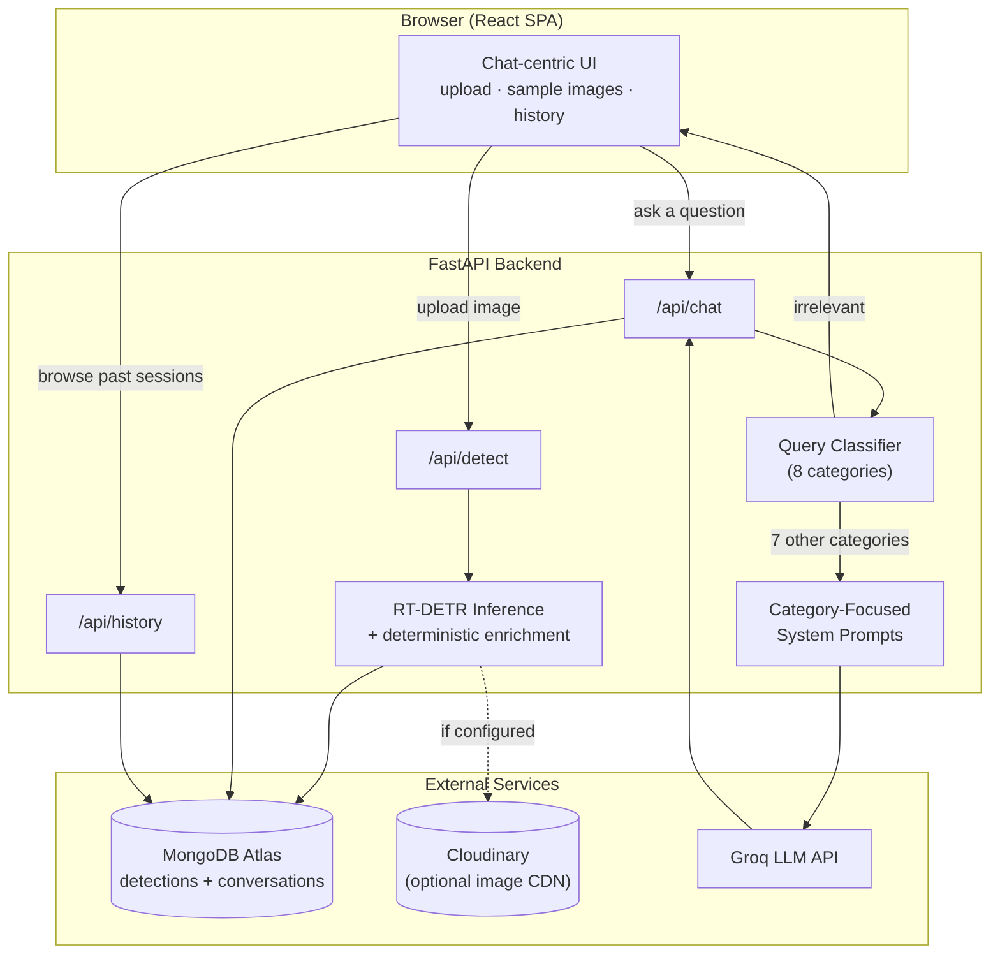

# Pothole Detection & AI Assistant

An end-to-end road-damage intelligence platform: an **RT-DETR** object detector finds potholes in
uploaded road imagery, and a **Groq-powered conversational assistant** — backed by a dedicated
query-classification layer — lets users ask natural-language questions about what was found,
answering honestly when a question asks for something the detector fundamentally cannot know.

This is not a toy demo wired to a single notebook cell. It is a full-stack application: a FastAPI
backend serving real-time inference, MongoDB Atlas for persistent detection and conversation
history, optional Cloudinary-backed image storage, a polished React chat interface, and a
documented, empirically-tested model with an honest accounting of its own failure modes.

---

## Table of Contents

1. [Live Deployments](#live-deployments)
2. [Key Features](#key-features)
3. [Dataset & Model Provenance](#dataset--model-provenance)
4. [Architecture](#architecture)
5. [Tech Stack](#tech-stack)
6. [Repository Structure](#repository-structure)
7. [How a Request Flows Through the System](#how-a-request-flows-through-the-system)
8. [The Reasoning Layer](#the-reasoning-layer)
9. [API Reference](#api-reference)
10. [Getting Started — Local Development](#getting-started--local-development)
11. [Running with Docker](#running-with-docker)
12. [Environment Variables](#environment-variables)
13. [Deployment](#deployment)
14. [Project Documentation](#project-documentation)
15. [Known Limitations](#known-limitations)
16. [Roadmap](#roadmap)
17. [Credits & Acknowledgments](#credits--acknowledgments)
18. [License](#license)

---

## Live Deployments

| Service | URL |
|---|---|
| Frontend (Vercel) | [pothole-chatbot.vercel.app](https://pothole-chatbot.vercel.app/) |
| Backend (Render) | [pothole-chatbot.onrender.com](https://pothole-chatbot.onrender.com/) |
| API Health Check | [pothole-chatbot.onrender.com/api/health](https://pothole-chatbot.onrender.com/api/health) |
| Interactive API Docs (Swagger) | [pothole-chatbot.onrender.com/docs](https://pothole-chatbot.onrender.com/docs) |

---

## Key Features

- **Real-time pothole detection** — upload a road image (or pick one of the built-in samples) and
  get back an annotated image with bounding boxes, per-box confidence, and derived attributes
  (grid position, relative size, size ranking among detections in the same image).
- **Unified, ChatGPT-style interface** — a single chat panel is the whole interaction surface:
  attach an image (drag-and-drop, file picker, or a sample thumbnail), optionally ask a question
  in the same turn, and the detection result renders inline as part of the conversation.
- **A chatbot that knows what it doesn't know** — every incoming question is classified into one
  of eight categories *before* an answer is generated. Questions about depth, repair cost, or
  structural safety are explicitly recognized as unanswerable from a 2D image and answered
  honestly instead of guessed at; off-topic questions are refused with a fixed, deterministic
  message rather than left to chance. See [The Reasoning Layer](#the-reasoning-layer).
- **Persistent history** — every detection and its full conversation is saved to MongoDB and
  browsable from a history panel; reopening a past session restores the exact detection result and
  transcript.
- **Cloud-native image storage (optional)** — annotated images are pushed to Cloudinary when
  configured, with an automatic, transparent fallback to local disk if Cloudinary is unset or
  unreachable, so the app never hard-fails on storage.
- **Empirically documented model behavior** — not just an accuracy number. Five real failure
  cases were mined directly from the validation set (small/distant objects, dense instance
  clutter, surface-texture domain gaps, background class confusion, debris occlusion), each with
  root-cause analysis and a reproducible diagnostic script. See
  [`document/document.md`](document/document.md).

---

## Dataset & Model Provenance

### Where the training dataset came from

The detector is trained on **[`andrewmvd/pothole-detection`](https://www.kaggle.com/datasets/andrewmvd/pothole-detection)**,
a 665-image, Pascal-VOC-XML-annotated, single-class (`pothole`) dataset hosted on **Kaggle**,
downloaded programmatically via `kagglehub.dataset_download()` (not a manual download — the
pipeline is reproducible end-to-end from the training notebook).

A second candidate dataset, `atulyakumar98/pothole-detection-dataset`, was evaluated first and
**rejected**: on inspection it turned out to be image-level classification data only (`normal/`
vs. `potholes/` folders, no bounding boxes), which cannot supervise an object detector. It was
repurposed instead as a weakly-labeled, out-of-distribution sanity-check set. The full reasoning
is documented in [`document/document.md` §1](document/document.md#1-why-this-domaindataset-and-how-it-was-sourced-and-labeled).

The bounding-box labels themselves are **inherited from the dataset publisher**, not
self-annotated — converted programmatically from VOC XML to YOLO format, with defensive cleaning
(clip-to-bounds, drop degenerate zero-area boxes) added after that cleaning turned out to matter
for training stability (see below).

### Where the trained model lives

| | |
|---|---|
| Weights | [`model/pothole_rtdetr_best.pt`](model/pothole_rtdetr_best.pt) — committed in this repository |
| Training notebook | [`model/dataset-pothole-detection.ipynb`](model/dataset-pothole-detection.ipynb) |
| Architecture | RT-DETR-L (Real-Time Detection Transformer, large variant), via [Ultralytics](https://docs.ultralytics.com/models/rtdetr/) |
| Base weights | `rtdetr-l.pt` (COCO-pretrained), fine-tuned on the dataset above |
| Training compute | Google Colab, NVIDIA T4 GPU |
| Full spec sheet | [`document/model_specification.md`](document/model_specification.md) |

At runtime, the backend loads these weights from `model/pothole_rtdetr_best.pt` relative to the
repository root (configurable via `WEIGHTS_PATH`), or downloads them from `WEIGHTS_URL` if the
local file isn't present — used for container deployments that don't ship the weights file
directly in the image.

---

## Architecture



---

## Tech Stack

**Frontend**
- React 19 + TypeScript, built with Vite
- Tailwind CSS v4 (+ `@tailwindcss/typography` for rendered chat markdown)
- `axios` for API calls, `react-markdown` for assistant replies, `lucide-react` for icons

**Backend**
- FastAPI (Python 3.11+/3.14-compatible) + Uvicorn (ASGI)
- Ultralytics `RTDETR` for inference, OpenCV for image I/O and annotation
- `pymongo` (MongoDB Atlas) for all persistent storage
- `groq` SDK for LLM calls (classification + response generation)
- `cloudinary` SDK for optional cloud image storage

**Infrastructure**
- MongoDB Atlas (managed, cloud)
- Cloudinary (managed, cloud — optional)
- Groq (LLM inference API)
- Docker (backend: CPU-only PyTorch image; frontend: multi-stage Node build → Nginx)
- Render (backend hosting, Docker runtime) + Vercel (frontend hosting)

---

## Repository Structure

```
.
├── Dockerfile                  # Root Dockerfile for the backend (Render build context: repo root)
├── docker-compose.yml          # Full local stack: MongoDB + backend + Nginx-served frontend
├── render.yaml                 # Render Blueprint (backend web service definition)
├── DEPLOYMENT.md               # Step-by-step production deployment guide
├── README.md                   # You are here
│
├── model/                      # Training artifacts
│   ├── pothole_rtdetr_best.pt      # Deployed weights (see Dataset & Model Provenance)
│   ├── dataset-pothole-detection.ipynb   # Full training notebook
│   ├── data.yaml                    # Ultralytics dataset config
│   └── pothole_dataset/             # train/valid/test image + label splits
│
├── document/                   # Written technical documentation (see below)
│   ├── document.md                  # Dataset, splits, metrics, 5 failure cases, reasoning layer
│   ├── model_specification.md       # Architecture, training config, deployed inference spec
│   ├── images/                      # Diagnostic figures referenced in document.md
│   └── scripts/                     # Reproducible failure-analysis scripts
│
├── backend/                    # FastAPI application
│   ├── Dockerfile
│   ├── requirements.txt
│   └── app/
│       ├── main.py                  # App wiring, lifespan, CORS, health check, SPA fallback
│       ├── config.py                # Environment-driven settings (pydantic-settings)
│       ├── inference.py             # Model loading + detection + enrichment
│       ├── chatbot.py                # Classify → route → respond orchestration
│       ├── query_classifier.py       # The 8-category classifier agent
│       ├── prompts.py                 # Per-category system prompts
│       ├── conversations.py           # MongoDB conversation read/write
│       ├── models.py                  # MongoDB detection read/write (Pydantic models)
│       ├── mongo_client.py            # MongoDB Atlas connection (TLS-aware)
│       ├── cloud_storage.py           # Optional Cloudinary upload, graceful fallback
│       ├── groq_client.py             # Shared Groq client
│       ├── schemas.py                 # Pydantic request/response schemas
│       └── routers/
│           ├── detect.py                  # POST /api/detect, GET /api/detections/{id}
│           ├── chat.py                    # POST /api/chat, GET /api/chat/{id}
│           └── history.py                 # GET /api/history, DELETE /api/history/{id}
│
└── frontend/                   # React application
    ├── Dockerfile                  # Multi-stage: Node build → Nginx
    ├── vercel.json                  # SPA rewrite rules for Vercel
    └── src/
        ├── App.tsx                      # Top-level layout, session reset
        ├── api/client.ts                 # Typed API client + backend health polling
        ├── components/
        │   ├── Header.tsx                    # Logo, nav, live backend-health dropdown
        │   ├── ChatPanel.tsx                  # The unified chat/upload/history interface
        │   ├── ChatBubble.tsx                 # Message rendering (incl. inline detection cards)
        │   ├── ImageUploader.tsx              # Drag-and-drop / file-picker attach control
        │   ├── SampleImages.tsx               # Built-in sample image picker
        │   ├── DetectionPanel.tsx             # Annotated image + per-box detail card
        │   └── HistoryPanel.tsx               # Slide-over past-session browser
        └── assets/                        # Logos, sample images
```

---

## How a Request Flows Through the System

1. **Upload / attach** — a user drops an image into the chat composer (or picks a sample). It is
   held client-side as a pending attachment until the message is sent.
2. **Detect** (`POST /api/detect`) — the image is saved, run through RT-DETR at the configured
   confidence threshold, and every returned box is enriched *in code* (not by an LLM) with a
   3×3-grid position label, relative area, a confidence tier, and a size rank relative to the
   other detections in the same image. The record is written to MongoDB; the annotated image is
   pushed to Cloudinary if configured, else served from local disk.
3. **Classify** (`POST /api/chat`, if a question was asked) — the message is sent to a dedicated,
   low-temperature classification call that sorts it into one of eight categories.
4. **Respond** — `irrelevant` questions are short-circuited to a fixed refusal string with no
   further model call. Every other category is answered by a second Groq call using a system
   prompt focused *only* on that category (see below), grounded in the structured detection data
   plus the running conversation history pulled from MongoDB.
5. **Persist & render** — both the user's message and the assistant's reply are appended to the
   conversation document in MongoDB, and the full exchange renders in the chat, including an
   inline card showing the annotated image and detection details.
6. **Browse history** — `GET /api/history` joins detection metadata with a per-conversation
   summary (message count, last message) for the history panel; selecting a past session
   re-fetches that exact detection and transcript and restores it into the chat.

---

## The Reasoning Layer

Rather than one large system prompt trying to cover every possible question, incoming messages
are first classified into one of these categories, each of which routes to its own short, focused
prompt:

| Category | Handles | Answer strategy |
|---|---|---|
| `presence` | "Is there a pothole?" | Read directly from the detection count |
| `count` | "How many potholes?" | Read directly from the detection count |
| `location` | "Where is it?" | Quote the precomputed position label — never re-derive from raw coordinates |
| `size` | "Which is biggest?" | Quote the precomputed size rank / relative area |
| `confidence` | "How sure are you?" | Quote the confidence value and tier, framed as a model estimate, not certainty |
| `summary` | General overview requests | Synthesize the full structured detection data |
| `uncertain` | Depth, repair cost, structural safety, danger severity | **Explicitly declines to guess** — states the limitation plainly, offers only generic, non-numeric guidance |
| `irrelevant` | Anything unrelated to the detection or road safety | Fixed refusal string, **no second model call is made** |

This design means the safety-critical case — a question that sounds answerable but isn't — gets a
dedicated instruction rather than being one bullet point lost in a long list, and the "don't
know" behavior is demonstrated concretely (with a worked example) in
[`document/document.md` §5](document/document.md#5-part-b-reasoning-layer-deciding-when-the-detectors-output-is-sufficient).

---

## API Reference

| Method | Path | Description |
|---|---|---|
| `POST` | `/api/detect` | Upload an image, run detection, return annotated result + enriched boxes |
| `GET` | `/api/detections/{id}` | Fetch a previously computed detection result |
| `POST` | `/api/chat` | Send a message about a detection; returns the classified-and-generated reply |
| `GET` | `/api/chat/{id}` | Fetch the full conversation history for a detection |
| `GET` | `/api/history` | List past detections with conversation summaries, most recent first |
| `DELETE` | `/api/history/{id}` | Delete a detection, its stored image(s), and its conversation |
| `GET` | `/api/health` | Liveness/readiness: backend, MongoDB, and model status |

Full interactive documentation (request/response schemas, try-it-out) is auto-generated at `/docs`
(Swagger UI) on the running backend.

---

## Getting Started — Local Development

### Prerequisites
- Python 3.11+ (3.14 supported)
- Node.js 20+
- A MongoDB Atlas connection string (free tier is sufficient)
- A Groq API key ([console.groq.com/keys](https://console.groq.com/keys) — free)
- (Optional) Cloudinary credentials — omit to use local disk storage instead

### Backend

```powershell
cd backend
python -m venv .venv
.venv\Scripts\activate
pip install --upgrade pip
pip install torch torchvision --index-url https://download.pytorch.org/whl/cpu
pip install -r requirements.txt

copy .env.example .env
# then edit .env: MONGODB_URI, GROQ_API_KEY at minimum

uvicorn app.main:app --reload --port 8000
```

The model weights load automatically from `../model/pothole_rtdetr_best.pt`; MongoDB collections
are created lazily on first write — no migration step required.

### Frontend

```powershell
cd frontend
npm install
npm run dev
```

Set `VITE_API_BASE_URL` in `frontend/.env` if the backend isn't at `http://localhost:8000` (the
app also auto-detects a non-localhost deployment and defaults to the live Render URL — see
`frontend/src/api/client.ts`).

Open **http://localhost:5173**.

---

## Running with Docker

The full stack — MongoDB, backend, and an Nginx-served frontend build — runs with one command:

```powershell
docker compose up --build
```

| Service | URL |
|---|---|
| Frontend | http://localhost:3000 |
| Backend API | http://localhost:8000 |
| Swagger Docs | http://localhost:8000/docs |
| Health Check | http://localhost:8000/api/health |

Provide `GROQ_API_KEY` (and optionally the Cloudinary variables) via `backend/.env` or exported
shell variables before running — MongoDB itself is provisioned automatically as a container, no
Atlas account needed for local Docker use.

---

## Environment Variables

**Backend** (`backend/.env`, see `backend/.env.example`):

| Variable | Required | Description |
|---|---|---|
| `MONGODB_URI` | Yes | MongoDB Atlas (or local) connection string |
| `MONGODB_DB_NAME` | No (default `pothole_detection`) | Database name |
| `GROQ_API_KEY` | Yes | Groq API key for chat |
| `GROQ_MODEL` | No (default `openai/gpt-oss-120b`) | Model used for generating replies |
| `GROQ_CLASSIFIER_MODEL` | No | Separate, smaller/faster model for the classifier stage; falls back to `GROQ_MODEL` |
| `CLOUDINARY_CLOUD_NAME` / `CLOUDINARY_API_KEY` / `CLOUDINARY_API_SECRET` | No | Enables Cloudinary image storage; omit any one to stay on local-disk storage |
| `CLOUDINARY_URL` | No | Alternative single-string form of the three Cloudinary values above |
| `WEIGHTS_PATH` | No | Local path to the `.pt` weights file |
| `WEIGHTS_URL` | No | Remote URL to download weights from if `WEIGHTS_PATH` doesn't exist (for containers that don't ship the weights) |
| `CONFIDENCE_THRESHOLD` | No (default `0.66`) | Minimum detection confidence surfaced to users |
| `CORS_ORIGINS` | No | JSON list or comma-separated list of allowed frontend origins |
| `MAX_UPLOAD_MB` | No (default `10`) | Maximum accepted upload size |

**Frontend** (`frontend/.env`):

| Variable | Required | Description |
|---|---|---|
| `VITE_API_BASE_URL` | No | Backend base URL; auto-detects the live Render backend when deployed on a non-localhost domain if unset |

---

## Deployment

Full step-by-step instructions (Render blueprint setup, MongoDB Atlas network access
configuration, Vercel environment variables, and manual alternatives) live in
[`DEPLOYMENT.md`](DEPLOYMENT.md). In short:

- **Backend → [Render](https://render.com)**, Docker runtime, via the included `render.yaml`
  blueprint or a manual Web Service pointed at the root `Dockerfile`.
- **Frontend → [Vercel](https://vercel.com)**, root directory `frontend/`, with `VITE_API_BASE_URL`
  set to the deployed Render URL.
- **Database → [MongoDB Atlas](https://www.mongodb.com/atlas)** — remember to allow network access
  from Render's dynamic IPs (`0.0.0.0/0`, or Render's static IP list on paid plans).

---

## Project Documentation

This README covers the *what* and *how to run it*. Two deeper documents cover the *why* and the
model's actual, measured behavior:

- **[`document/document.md`](document/document.md)** — dataset selection rationale (including a
  rejected candidate dataset), train/val/test split strategy and its honest limitations,
  evaluation metrics with an explicit discussion of what they do and don't tell you, **five
  empirically-mined failure cases** with root-cause analysis and diagnostic images, and a worked
  example of the reasoning layer's "insufficient information" behavior.
- **[`document/model_specification.md`](document/model_specification.md)** — the model's spec
  sheet: exact architecture breakdown, full training configuration (including a real NaN-loss
  divergence encountered and how it was fixed), input/output contract, and the actually-deployed
  inference configuration with measured latency.

---

## Known Limitations

Summarized from `document/document.md` (full detail and evidence there):

- The validation split doubles as the model-selection split, so reported metrics are not a fully
  unbiased generalization estimate; a held-out test split exists but hasn't been used for a final
  independent evaluation.
- Single-class only — no notion of pothole depth, severity, or type.
- Documented weak points: small/distant objects, densely clustered instances, non-asphalt (gravel)
  surfaces, and background objects (e.g. parked vehicles) that visually resemble a pothole.
- Confidence scores are not calibrated (no reliability-diagram verification has been done).

---

## Roadmap

- [ ] Run a true held-out evaluation on the untouched test split
- [ ] Confidence calibration analysis (reliability diagram)
- [ ] Hard-negative training examples for the vehicle/shadow class-confusion failure mode
- [ ] GPU-backed inference for sub-second response times in production
- [ ] Automated regression tests around the query classifier's category boundaries

---

## Credits & Acknowledgments

- **Dataset**: [`andrewmvd/pothole-detection`](https://www.kaggle.com/datasets/andrewmvd/pothole-detection) on Kaggle
- **Model architecture**: [RT-DETR](https://arxiv.org/abs/2304.08069), via [Ultralytics](https://www.ultralytics.com/)
- **LLM inference**: [Groq](https://groq.com/)
- **Database**: [MongoDB Atlas](https://www.mongodb.com/atlas)
- **Image storage**: [Cloudinary](https://cloudinary.com/)
- Built by **Rapid Acceleration Partners**

---

## License

No license has been declared for this repository yet. Add a `LICENSE` file (e.g. MIT, Apache 2.0)
before treating this project as open for external use or redistribution.
